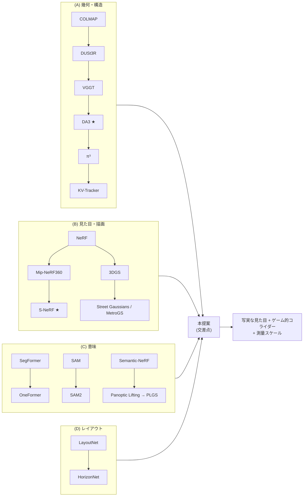
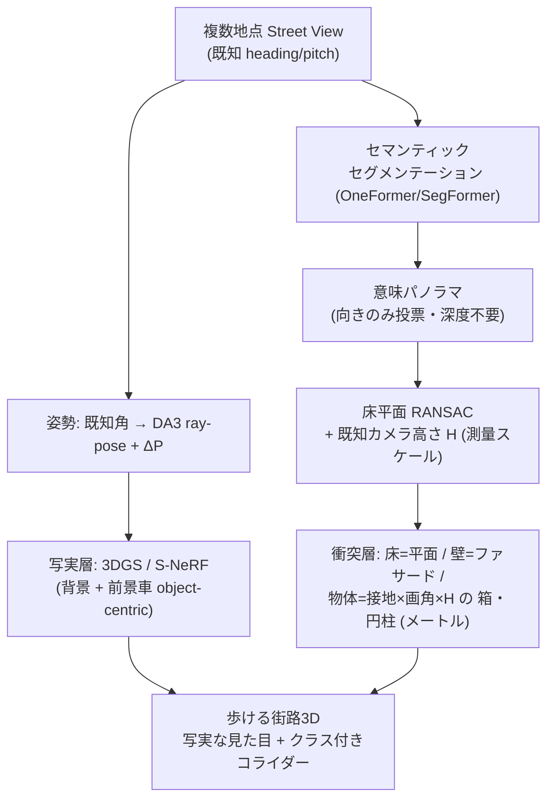

# Surveyed Streets — 論文ドラフト

**英題 (Title):** *Surveyed Streets: Photorealistic Appearance with Game-Style Primitive Colliders for Walkable 3D Streets from Monocular Street-View Panoramas — without LiDAR or Given 3D Boxes*

> 単眼の Street View パノラマ群（複数地点）から、**写実的な見た目**と**ゲーム的なプリミティブ衝突判定**を分離して構築する、LiDAR・与えられた3D箱・専用深度センサに依存しない街路3D手法。
>
> 構成: Abstract / 1. Introduction / 2. Related Work / 3. Method / 4. Implementation / 5. Experiments / 6. Limitations / 7. Conclusion。
> 元資料: [new_paper_concept.md](new_paper_concept.md)（手法）, [tech_genealogy.md](tech_genealogy.md)（系譜）, [semantic_scene_colliders.md](semantic_scene_colliders.md)（実装方針）。
> ※ これは作業用の日本語ドラフト。投稿時は英語化＋図表＋定量評価を追加する。

---

## Abstract

複数地点の Street View 画像をつなげて「歩ける街の3D」を作る課題に取り組む。既存研究は
**写実的レンダリング**（NeRF/3DGS）か**正確な密幾何**（SfM/学習pointmap）のいずれかを追うが、
ゲーム的に「歩いて衝突できる」体験には、完璧な密メッシュは過剰であり、疎・広ベースライン・
動的物体を含む Street View では破綻しやすい。本稿は **見た目と衝突を二層に分離** する：
(1) **写実層** は 3DGS/S-NeRF で背景と前景車を描く。(2) **衝突層** は、セマンティック
セグメンテーションと **既知カメラ高さを“測量の標尺”** とした幾何により、床/壁/天井の平面と
物体の箱/円柱を**メートル単位のプリミティブ・コライダー**として生成する。物体の大きさは
S-NeRF が依存した「与えられた3D箱」や LiDAR を使わず、**接地点 × 画角 × カメラ高さ**で推定する。
カメラ姿勢は Street View の**既知 heading/pitch** を初期値に、DA3 の ray-pose と S-NeRF 型の
ΔP 改善で堅牢化する。提案の中核（測量スケール・床/壁/物体コライダー）はプロトタイプとして
実装済みである。

> **Abstract (English).** We address building *walkable* 3D streets by stitching multi-site Google Street-View
> panoramas. Prior work pursues either photorealistic rendering (NeRF/3DGS) or accurate dense geometry
> (SfM / feed-forward point maps); however, a *game-style* walk-and-collide experience does not require a perfect
> dense mesh, which is brittle under the sparse, wide-baseline, dynamic content of street views. We **decouple
> appearance from collision** into two layers: (1) an *appearance layer* renders background and foreground vehicles
> with 3DGS/S-NeRF; (2) a *collision layer* produces **metric primitive colliders** (floor/wall planes, object
> boxes/cylinders) from semantic segmentation and a **known camera height used as a surveying datum**. Object size
> is estimated from **ground contact × field-of-view × camera height**, removing S-NeRF's reliance on given 3D
> boxes and LiDAR. Camera poses are initialized from Street View's **known heading/pitch** and refined with DA3
> ray-pose and S-NeRF-style ΔP. The core (surveyed scale, floor/wall/object colliders) is implemented as a prototype.

---

## 1. Introduction

**目標**: Google Street View のような**離散した複数地点**の画像から、ユーザが連続的に歩き回れる
3D 空間を作る。要件は二つ：**(i) 見た目は写実的**、**(ii) 衝突判定はゲーム的（近似プリミティブで可）**。

**課題**:
- Street View は**疎・広ベースライン・低重複**で、COLMAP 等の古典 SfM/MVS が苦手。
- 単眼深度（DA3 等）を per-view で使い、各地点の球を**別々に生成して重ねる**と、同一面が二重化して
  「重なり・崩れ」が出る（本プロジェクトで観測）。
- 単眼深度は**遠方を圧縮**し、床が水平線に向かって**せり上がる**（お椀状）。
- 動的物体（人・車）が幾何を汚す。
- 絶対スケールが不定（LiDAR や既知3D箱が無い）。

**鍵となる洞察**: ゲームの衝突は**完璧な面である必要がない（箱で十分）**。よって「写実な見た目」と
「粗いコライダー」を**分離**し、後者を**意味＋レイアウト＋測量**という安価で堅牢な経路で作る。

**貢献**:
1. **測量基準スケール**: 既知カメラ高さ（Street View ≈ 2.5m）を標尺とし、床平面 RANSAC で
   絶対スケールと水平を確定。LiDAR（S-NeRF）も学習メトリック（DA3）も不要。
2. **意味プリミティブ・コライダー**: セグメンテーション→床/壁/天井の平面＋物体の箱/円柱を
   **ゲーム即用のメートル単位コライダー**として出力。再構成と相互作用を橋渡し。
3. **箱なし物体サイズ推定**: 物体の**接地点 × 画角 × カメラ高さ**で寸法を算出（与えられた3D箱・LiDAR 不要）。
4. **既知取得角を初期姿勢に**: Street View の heading/pitch を S-NeRF 型 ΔP 改善の初期値とし、
   DA3 ray-pose を併用。
5. **見た目と衝突の二層分離**という設計原理そのもの。

---

## 2. Related Work

詳細な系譜は [tech_genealogy.md](tech_genealogy.md)。要約：

- **幾何 (A)**: COLMAP(2016) → DUSt3R/MASt3R(2024) → VGGT → **DA3**(2025, SOTA) / **π³**(2026) → KV-Tracker。
  特徴点マッチを学習 pointmap 回帰へ置換。疎視点に強い。
- **描画 (B)**: NeRF(2020) → Mip-NeRF360 → 街路 Block-NeRF / **S-NeRF** / StreetSurf；
  **3DGS**(2023) → Street Gaussians / StreetSurfGS / MetroGS；メッシュ化 SuGaR / DN-Splatter。
- **意味 (C)**: SegFormer / Mask2Former → **OneFormer**；SAM → **SAM2**；
  3Dリフト Semantic-NeRF → **Panoptic Lifting** → PLGS。
- **レイアウト (D)**: LayoutNet → **HorizonNet** → DuLa-Net（床/壁/天井, Manhattan）。

**本稿の位置**: (A)で姿勢、(B)で見た目、(C)+(D)+測量で衝突。既存は (A) か (B) の一方を突き詰めるのに対し、
本稿は**衝突を粗いプリミティブに割り切り**、(C)(D)＋測量で安価・堅牢に作る点が異なる（Fig.2）。

<small>**Fig.2** 4系統の系譜と本提案の位置。詳細は [tech_genealogy.md](tech_genealogy.md)。</small>

---

## 3. Method

### 3.1 概要：二層アーキテクチャ

**見た目（写実）**と**衝突（ゲーム的プリミティブ）**を分離する（Fig.1）。

<small>**Fig.1** 二層パイプライン。写実層と衝突層は同じ測量スケール・同じ座標系を共有する。</small>

### 3.2 カメラ姿勢
Street View は取得時の `heading, pitch, fov` が既知 → これを**初期姿勢** $P_0=[R_0,T_0]$ とする。
必要に応じて DA3 の **ray-pose**（ray map $\mathbf{M}$ から $\mathbf{H}=\mathbf{K}\mathbf{R}$ を DLT→RQ分解）で精緻化し、
S-NeRF 型の学習補正 $\Delta P=(\Delta R,\Delta T)$ で残差を吸収する。Street View では $P_0$ が強いので、
完全 pose-free よりドリフトが小さい。

### 3.3 セマンティックセグメンテーション
各ビューを Cityscapes クラスへ分類（SegFormer / OneFormer）。本プロジェクトのカテゴリへ集約：
`floor(road,sidewalk,terrain) / wall(building,wall,fence) / sky / pole / vegetation / person / vehicle`。
各ビューのカテゴリを、**向きのみ**（深度不要、d=normalize(R·K⁻¹·p)）で **equirect に多数決投票** し、
視点で整合した**意味パノラマ** cat_eq を得る。

### 3.4 測量基準スケール（既知カメラ高さ）
意味パノラマの floor 画素（水平線下）を RANSAC で平面フィットし、法線 $\mathbf{n}$（鉛直）と
カメラ原点からの距離 $H_{\mathrm{da3}}$ を得る。既知カメラ高さ $H$（≈2.5m）を標尺に
**メートルスケール** $s = H / H_{\mathrm{da3}}$ を確定。床法線で**傾き（tilt）も補正**。
これにより、単眼で生じる「床のせり上がり」を**解析的な水平床平面**で平らにできる
（床帯の画素を平面へスナップ, Fig.4）。

<figure>
<svg viewBox="0 0 520 240" width="100%" style="max-width:560px;background:#fff;border:1px solid #ddd;border-radius:8px">
  <line x1="40" y1="70" x2="500" y2="70" stroke="#999" stroke-dasharray="5 4"/>
  <text x="430" y="63" font-size="12" fill="#777">水平線(horizon)</text>
  <circle cx="60" cy="70" r="5" fill="#333"/>
  <text x="68" y="62" font-size="12" fill="#333">カメラ (高さ H)</text>
  <line x1="60" y1="70" x2="60" y2="200" stroke="#bbb" stroke-dasharray="3 3"/>
  <path d="M 100,200 Q 330,175 500,95" fill="none" stroke="#e0504f" stroke-width="2.5" stroke-dasharray="6 4"/>
  <text x="300" y="150" font-size="12" fill="#e0504f">単眼: 床がせり上がる(お椀)</text>
  <line x1="40" y1="200" x2="500" y2="200" stroke="#2e9e5b" stroke-width="2.5"/>
  <text x="320" y="218" font-size="12" fill="#2e9e5b">スナップ後: 平らな水平床 (y=-H)</text>
</svg>
<figcaption><small><b>Fig.4</b> 床平面スナップ前後（側面図）。単眼深度は遠方を圧縮し床が水平線へせり上がる（赤）。既知カメラ高さの平面へスナップすると平ら（緑）になる。</small></figcaption>
</figure>

### 3.5 床/壁/天井コライダー（レイアウト＋測量）
- **床**: y=-H の水平平面コライダー。
- **壁（ファサード）**: 方位セクタ毎に、**床-壁境界**の視線を床平面に交差させて壁の**基部距離**を求め、
  そこに鉛直パネル（箱）を立てる。高さは壁画素の角度範囲 × 距離。
- **天井/空**: sky は遠景ドーム（衝突なし）。
⇒ 深度推定ゼロで「コリドー（床＋両脇ファサード＋空）」が出る。

### 3.6 物体サイズ推定（箱なし・測量原理）
物体カテゴリ（vehicle/person/pole）の連結成分ごとに、**接地点（最下画素）の視線**を
カメラ高さ $H$ の床平面に交差させ距離 $d$ を得る（俯角 $\varphi$ から $d = H/\tan\varphi$）。
物体の角度範囲 $(\Delta\theta,\Delta\varphi)$ から寸法を得る（Fig.3）：

$$\text{幅} \approx \Delta\theta \cdot d, \qquad \text{高さ} \approx \tan(\Delta\varphi)\cdot d.$$

vehicle/person は**箱**、pole は**円柱**コライダーを設置。S-NeRF が依存した「与えられた3D箱」を、
**単眼＋カメラ高さ**で代替する。

<figure>
<svg viewBox="0 0 520 280" width="100%" style="max-width:560px;background:#fff;border:1px solid #ddd;border-radius:8px">
  <line x1="40" y1="240" x2="500" y2="240" stroke="#2e9e5b" stroke-width="2"/>
  <text x="44" y="256" font-size="11" fill="#2e9e5b">床平面 (カメラ高さ H の水平面)</text>
  <line x1="60" y1="60" x2="500" y2="60" stroke="#bbb" stroke-dasharray="5 4"/>
  <text x="430" y="54" font-size="11" fill="#999">水平線</text>
  <circle cx="60" cy="60" r="5" fill="#333"/>
  <text x="14" y="50" font-size="12" fill="#333">カメラ</text>
  <line x1="60" y1="60" x2="60" y2="240" stroke="#888" stroke-dasharray="3 3"/>
  <text x="30" y="155" font-size="13" fill="#333">H</text>
  <line x1="60" y1="60" x2="400" y2="240" stroke="#333" stroke-width="1.5"/>
  <line x1="60" y1="60" x2="400" y2="150" stroke="#666" stroke-width="1.2" stroke-dasharray="4 3"/>
  <path d="M 95,60 A 35 35 0 0 1 88,82" fill="none" stroke="#e0504f" stroke-width="1.4"/>
  <text x="98" y="84" font-size="12" fill="#e0504f">φ</text>
  <text x="120" y="120" font-size="11" fill="#666">Δφ</text>
  <rect x="385" y="150" width="30" height="90" fill="#4e7fdc" fill-opacity="0.55" stroke="#3358a8"/>
  <text x="420" y="200" font-size="12" fill="#3358a8">物体</text>
  <line x1="60" y1="248" x2="400" y2="248" stroke="#333" stroke-dasharray="2 2"/>
  <text x="210" y="270" font-size="12" fill="#333">d = H / tan(φ)</text>
  <text x="392" y="146" font-size="11" fill="#3358a8">高さ≈tan(Δφ)·d</text>
</svg>
<figcaption><small><b>Fig.3</b> 物体サイズの測量原理（側面図）。接地点への俯角 φ と既知カメラ高さ H から距離 d を求め、物体の角度範囲 (Δθ,Δφ) と d で幅・高さを算出する。LiDAR や与えられた3D箱を使わない。</small></figcaption>
</figure>

### 3.7 多地点融合（重なりを起こさない）
「別々の球を生成して重ねる」のではなく、**信頼度加重融合**（S-NeRF の $\hat{\mathcal{C}}=\sum_i \omega_i \mathcal{C}_i$）と
**Umeyama＋TSDF**（DA3）で**1つの整合表現**へ。コライダーは**地点間で共有する床平面**に接地させ、
GPS(ENU) で水平配置を固定して視点間スケール不整合を排除する（Fig.5）。

<figure>
<svg viewBox="0 0 560 210" width="100%" style="max-width:600px;background:#fff;border:1px solid #ddd;border-radius:8px">
  <line x1="280" y1="10" x2="280" y2="200" stroke="#eee"/>
  <!-- Panel A: overlay -->
  <text x="20" y="26" font-size="12" fill="#e0504f">(a) 別生成→合体 (overlay)</text>
  <line x1="20" y1="175" x2="255" y2="175" stroke="#2e9e5b" stroke-width="1.5"/>
  <circle cx="60" cy="150" r="4" fill="#333"/><circle cx="110" cy="150" r="4" fill="#333"/>
  <text x="40" y="198" font-size="10" fill="#777">地点1   地点2</text>
  <rect x="170" y="70" width="40" height="105" fill="#e0504f" fill-opacity="0.45"/>
  <rect x="184" y="80" width="40" height="95" fill="#e0504f" fill-opacity="0.45"/>
  <text x="150" y="62" font-size="11" fill="#e0504f">同じ壁が二重化(ghosting)</text>
  <!-- Panel B: fusion -->
  <text x="300" y="26" font-size="12" fill="#2e9e5b">(b) 信頼度融合 (fusion)</text>
  <line x1="300" y1="175" x2="540" y2="175" stroke="#2e9e5b" stroke-width="1.5"/>
  <circle cx="340" cy="150" r="4" fill="#333"/><circle cx="390" cy="150" r="4" fill="#333"/>
  <text x="320" y="198" font-size="10" fill="#777">地点1   地点2</text>
  <rect x="470" y="72" width="40" height="103" fill="#4e7fdc" fill-opacity="0.6" stroke="#3358a8"/>
  <text x="430" y="62" font-size="11" fill="#3358a8">単一の整合面</text>
  <line x1="340" y1="150" x2="470" y2="120" stroke="#bbb" stroke-dasharray="3 3"/>
  <line x1="390" y1="150" x2="470" y2="135" stroke="#bbb" stroke-dasharray="3 3"/>
</svg>
<figcaption><small><b>Fig.5</b> 多地点融合。(a) 各地点を別生成して重ねると同じ壁が二重化し崩れる（本プロジェクトで観測）。(b) 共有床平面＋信頼度加重融合で単一の整合面にすると重なりが消える。</small></figcaption>
</figure>

### 3.8 写実層
背景は S-NeRF の無限遠正規化 $f(x)$（$r$=3m）または 3DGS。前景車は **object-centric NeRF**
（仮想カメラ変換 $\hat{P}_i = P_b P_i^{-1}$）。意味コライダーと**同じ座標系・同じ測量スケール**に置く。

---

## 4. Implementation（プロトタイプ）

本リポジトリ（WorldMap 3D）に、提案の中核を実装済み：
- `app/semseg.py` — SegFormer (Cityscapes) によるカテゴリ分類（floor/wall/.../vehicle）。
- `app/colliders.py` — §3.3–3.6：意味パノラマ→床平面・壁・物体の**メートル単位コライダー**＋
  クラス色デバッグメッシュ＋`colliders` JSON（`{class,type,center,size,yaw}`）。
- `app/panorama3d.py::_ground_plane_cap` — §3.4：床平面 RANSAC（共分散3×3固有分解）＋既知高さスケール＋
  床帯スナップ（せり上がり/傾き除去）。
- フロント `SceneViewer`（既存）— BVH 当たり判定で**生成コライダーをそのまま歩行・衝突**。
- バックエンド `method="colliders"` エンドポイント、GPU 解放（全モデル `unload()`）。

未実装（次段）: 取得角→姿勢の完全 DA3-free 化、S-NeRF 型信頼度融合での多地点統合、3DGS 写実層、SAM2 動的除去。

---

## 5. Experiments

### 5.1 予備結果（プロトタイプ動作確認）
中核（§3.3–3.6）のプロトタイプを、合成街路パノラマ（空/建物/道路の帯＋物体）で動作確認した：
- セグメンテーション（SegFormer-Cityscapes）→ 意味パノラマ生成 → **床1平面＋壁64セクタ**のメートル単位コライダーを生成、glb 出力に成功。
- 床平面 RANSAC（§3.4）を本番解像度（equirect 幅1536, 約23万点）で実行 → **2.3秒**、傾き 5°→4.86° を回復、床帯スナップでせり上がりを除去（合成データでの定量）。
- 生成コライダーは既存ビューワー（BVH 当たり判定）で**そのまま歩行・衝突可能**。

※ 合成データでの動作確認であり、**実 Street View による定量評価（下記プロトコル）は今後**。物体（車/人/柱）の検出は実画像で評価する。

### 5.2 評価プロトコル（本評価・構想）
- **幾何精度**: 床の平面性（残差）・壁の直交性・**物体寸法のメートル誤差**（巻尺/Google実測比）。
- **衝突品質**: 歩行可能率・壁/床の**貫通率**・引っかかり。
- **見た目**: 新視点の PSNR/SSIM/LPIPS（写実層）。
- **アブレーション**:
  (a) カメラ高さ標尺の有無 → スケール/床の正しさ、
  (b) LiDAR 無し vs S-NeRF、
  (c) 与えられた3D箱 無し vs S-NeRF（物体サイズ）、
  (d) 別生成→合体 vs 信頼度融合（重なり率）。
- **データ**: 任意都市の Street View 連続地点。GT は OSM/実測の建物フットプリント・道路幅。

---

## 6. Limitations
- 床平面（カメラ高さ一定・水平）の仮定 → 坂・段差・自転車/車載で高さが変わる場面に弱い（高さ自動推定で緩和）。
- セグメンテーション誤りがコライダーへ直結。
- 「ゲーム的コライダー」は形が粗い（写実面との一致は近似）。
- 取得角の精度・パノラマ歪み。

## 7. Conclusion
見た目（写実）と衝突（ゲーム的プリミティブ）を**分離**し、衝突層を**意味＋レイアウト＋測量**で作ることで、
LiDAR や与えられた3D箱に依存せず、疎な Street View から**歩ける街の3D**を堅牢に構築できる。
中核は実装済みで、写実層（3DGS）と多地点信頼度融合の統合が次の課題。

---

## References
[tech_genealogy.md](tech_genealogy.md) の出典一覧を参照。主要: DA3 (arXiv:2511.10647), S-NeRF (arXiv:2303.00749),
VGGT (arXiv:2503.11651), π³ (arXiv:2507.13347), OneFormer (arXiv:2211.06220), SAM2, 3DGS, Panoptic Lifting,
HorizonNet (arXiv:1901.03861), COLMAP。
